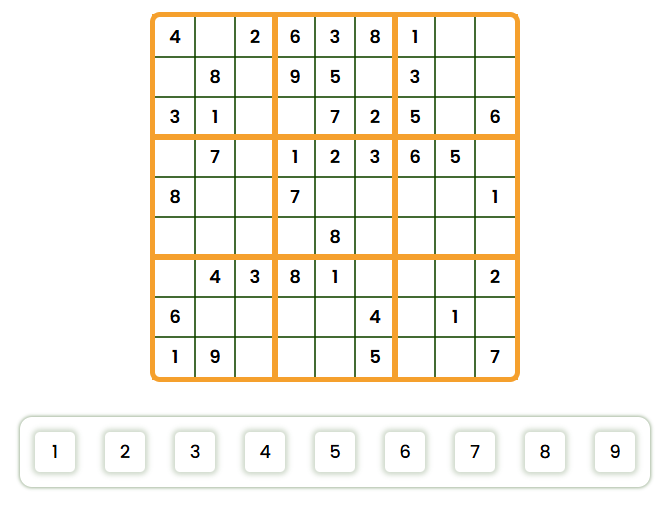

<h1 align="center"> S U D O K U </h1>

    

This sudoku was made for a college course. In this project I wanted to also create a bit customizability and a profile for the player in addition for the sudoku. I also wanted to implement a system to traverse the cells in the sudoku easier, and ended up doing it ny using arrow keys for it. With this project I learned more about local storage and handling files to save and load data, slightly since I didn't want to take this project as far as setting up a server for profile saving data. The data is also in JSON-format, so editing it isn't hard to cheat isn't hard, but I think it doesn't matter.

<h2 align="center"> C U S T O M I Z E </h1>

    

You can select one from the 4 custom picked color options from a side menu. The choice you make will be saved and when loading the file the page automatically changes to the saved color.

<h2 align="center"> S A V E  &  L O A D  D A T A </h1>

    

In the same side menu there also is the options to save and load data. If no file is chosen, saving the game will create a new file and download it. If a file is loaded, it will be updated when saving.

<h2 align="center"> P R O F I L E </h1>

    

You can get to the profile menu from the side bar or from the main menu. In there, you can change your name and your profile picture from preselected options. The amount of games you have played to the end of each difficulty is also shown in your profile.
